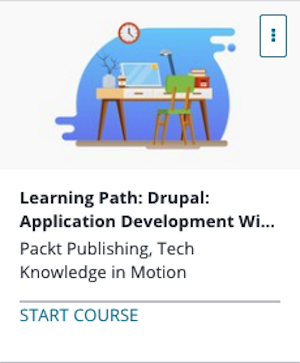

```
Roberto Nogueira  
BSd EE, MSd CE
Solution Integrator Experienced - Certified by Ericsson
```
# Udemy Learning Path Drupal



**About **

Learn everything you need to about the subject of this `Udemy` project.

[Homepage](https://www.udemy.com/learning-path-drupal-application-development-with-drupal-8/learn/v4/content)

## Topics
```
Section: 1
0 / 37
Drupal 8 for Beginners
[x] 1. The Course Overview 6:42
[x] 2. What's New 5:35
[x] 3. Installing MAMP 3:24
[x] 4. Downloading Drupal 8 3:08
[ ] 5. Setting Up the Database 2:28
[ ] 6. Installing Drupal 8 6:00
[ ] 7. It's Alive 6:13
[ ] 8. Content Types in Drupal 8 9:01
[ ] 9. Extending Your Reach with Modules 6:40
[ ] 10. Using Blocks with Drupal 8 7:51
[ ] 11. Creating Contact Forms 6:08
[ ] 12. Understanding Views 4:31
[ ] 13. Setting up a View 9:22
[ ] 14. Working with Contextual Filters 7:29
[ ] 15. Sending it Out with REST-First 8:49
[ ] 16. Downloading a Theme 7:39
[ ] 17. Custom Theming Part 1 Info File 7:29
[ ] 18. Custom Theming Part 2 Files and Folder Structure 7:34
[ ] 19. Custom Theming Part 3 Template Overriding 9:37
[ ] 20. Roles and Permissions 8:10
[ ] 21. Database Transfer 5:43
[ ] 22. File Transfer 7:15
[ ] 23. Managing Module Updates 9:25
[ ] 24. Managing Core Updates 6:38
[ ] 25. Reading the Reports 7:44
[ ] 26. Setting up the Content Types 6:07
[ ] 27. Creating Roles 6:38
[ ] 28. Creating Our News Feed Views 7:02
[ ] 29. Creating an RSS View Feed 3:40
[ ] 30. Creating a Recent News Block 5:41
[ ] 31. Adding a Contact Form 5:03
[ ] 32. Setting Up a REST API 5:11
[ ] 33. Naming and Placing your Extension 6:39
[ ] 34. Creating a Composer File 4:23
[ ] 35. Creating the Info File 5:44
[ ] 36. Adding Functionality 5:36
[ ] 37. Understanding Additional Files 8:05

Section: 2
0 / 44
Drupal 8 Development Solutions
[ ] 38. Installing Drupal 8:42
[ ] 39. Tools for Setting Up an Environment 3:43
[ ] 40. Configuring the WYSIWYG Editor 4:23
[ ] 41. Adding and Editing the Content 4:45
[ ] 42. Creating a Menu and Linking Content 3:45
[ ] 43. Providing Inline Editing 2:26
[ ] 44. Creating a Custom Content Type 3:09
[ ] 45. Applying a New Drupal 8 Core Field Types 8:28
[ ] 46. Customizing the Form Display and the Displaying Output of a Node 6:24
[ ] 47. Listing Content 5:06
[ ] 48. Editing the Default Admin Interfaces 3:23
[ ] 49. Creating a Block from a View 2:52
[ ] 50. Utilizing Dynamic Arguments 2:33
[ ] 51. Adding a Relationship in a View 3:12
[ ] 52. Providing an Entity Reference Result View 3:35
[ ] 53. Creating a Module 3:10
[ ] 54. Defining a Custom Page 3:34
[ ] 55. Defining Permissions 3:03
[ ] 56. Providing the Configuration on Installation or Update 3:34
[ ] 57. Using Features 2.x 4:46
[ ] 58. Creating a Custom-Based Theme on Classy 8:35
[ ] 59. Using the New Asset Management System 10:41
[ ] 60. Twig Templating 7:35
[ ] 61. Using the Breakpoint Module 5:12
[ ] 62. Using the Responsive Image Module 5:47
[ ] 63. Creating a Form 10:19
[ ] 64. Using New HTML5 Elements 6:03
[ ] 65. Validating Form Data 6:53
[ ] 66. Processing Submitted Form Data 6:31
[ ] 67. Altering Other Forms 6:33
[ ] 68. Creating Blocks Using Plugins 4:56
[ ] 69. Creating a Custom Field Type 5:17
[ ] 70. Creating a Custom Field Widget 4:17
[ ] 71. Creating a Custom Field Formatter 3:34
[ ] 72. Creating a Custom Plugin Type 5:44
[ ] 73. Translating Administrative Interfaces 12:21
[ ] 74. Translating Configuration 5:55
[ ] 75. Translating Content 6:47
[ ] 76. Creating Multilingual Views 8:11
[ ] 77. Importing and Exporting Configurations 4:19
[ ] 78. Synchronizing Site Configurations 2:46
[ ] 79. Using the Filesystem for Configuration Storage 6:21
[ ] 80. Implementing and Using a Third-Party JavaScript Library 3:53
[ ] 81. Implementing and Using a Third-Party CSS Library 4:40
```
